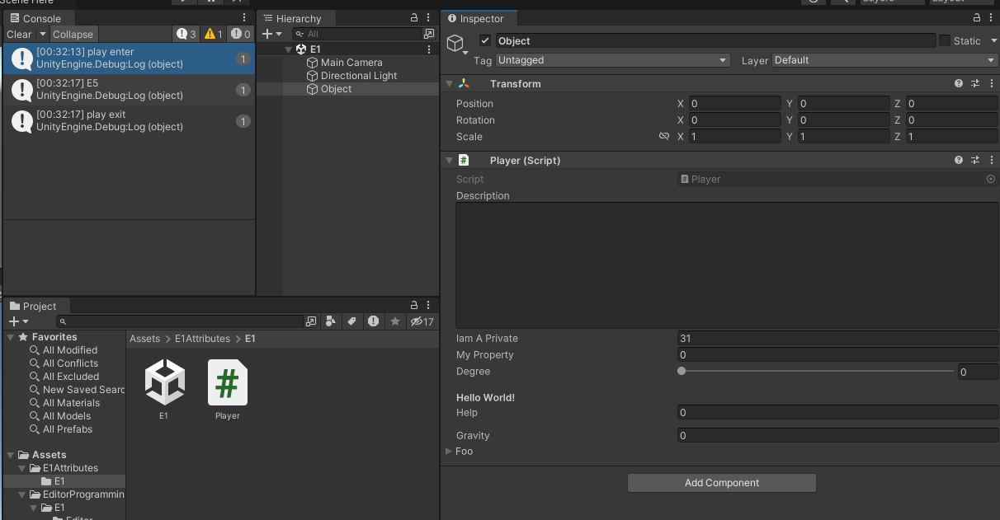
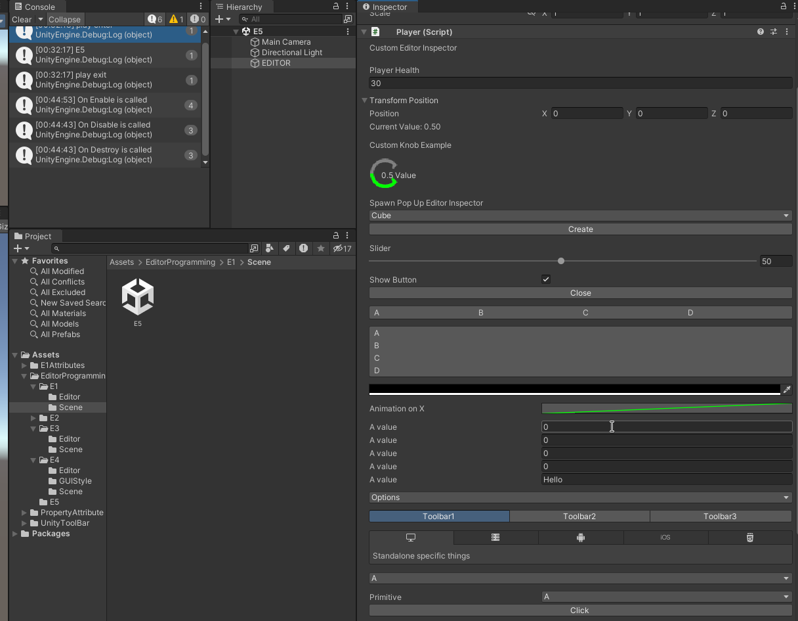
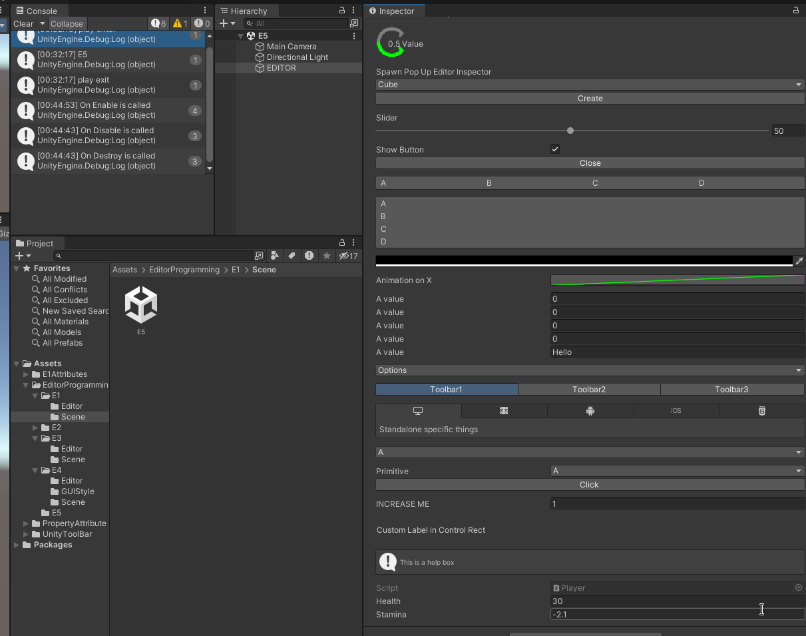
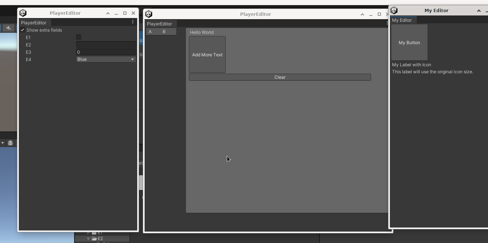
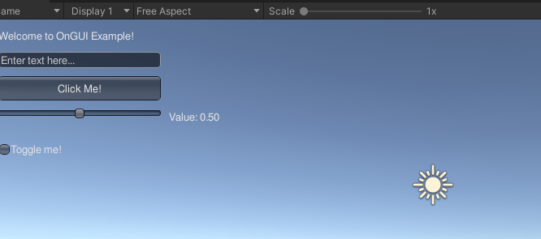

# UnityEditorTools

This repository contains a collection of custom editor tools designed to enhance the Unity development experience, focusing on improved scene management and GUI integration.

## Features

- **Custom Toolbar Integration**: Add custom buttons to the Unity toolbar for easy access to scene management functionalities.

- **Scene Management**:
    - Displays a list of scenes added to the build settings.
    - Allows users to start scenes and switch to play mode directly from the toolbar.
    - Supports adding scenes through drag-and-drop functionality.

- **Play Mode State Tracking**: Logs state changes when entering or exiting play mode.

- **Dynamic GUI Elements**: Utilizes Unity's IMGUI system to create interactive GUI elements for scene selection and management.

## Demo

**[AddIconToToolbar.cs](Assets/EditorProgramming/E5/AddIconToToolbar.cs)**:
you can use AddIconToToolbar.cs to add a scene to toolbar dynamically.

# Got help from 
* https://github.com/marijnz/unity-toolbar-extender

specifically manipulating Unity's IMGUI system and VisualElement to extend or modify the Unity Editor's user interface. The technique of injecting custom buttons into the toolbar using reflection is a well-known workaround because Unity doesn't provide a direct API for modifying the Play toolbar.